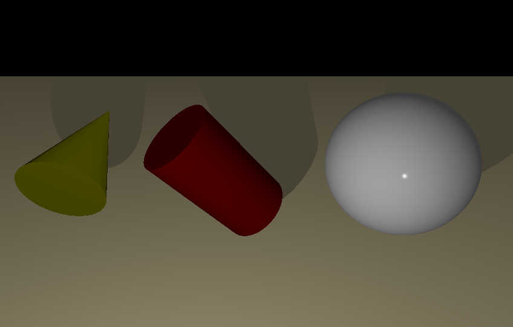
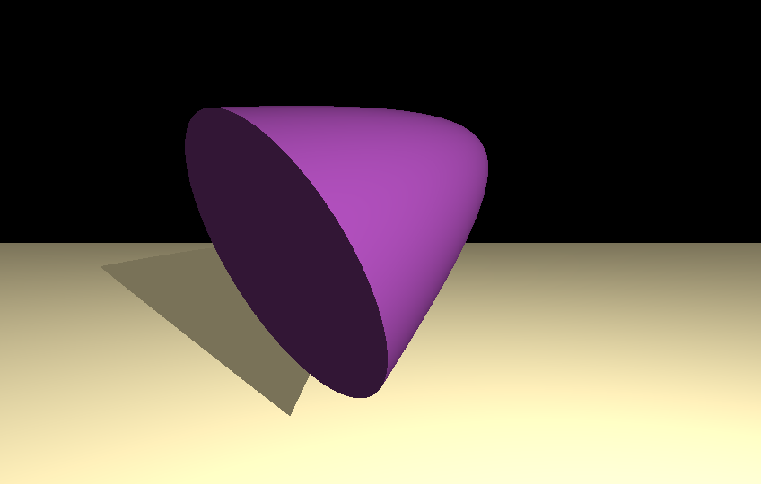
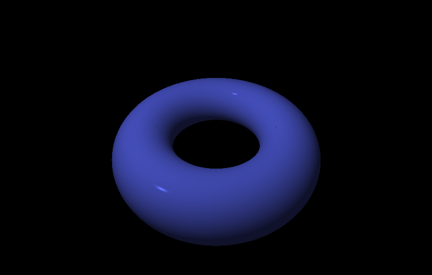
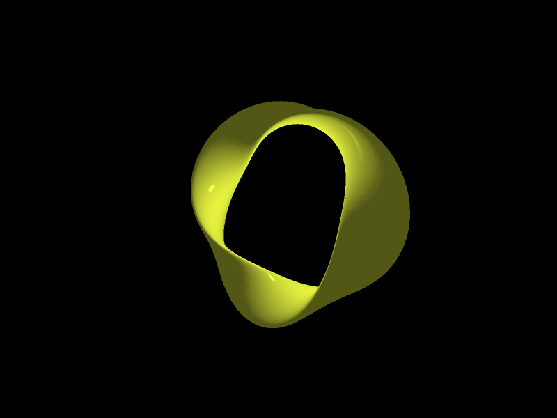
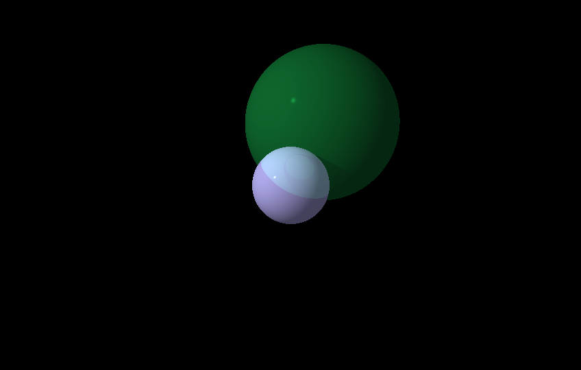
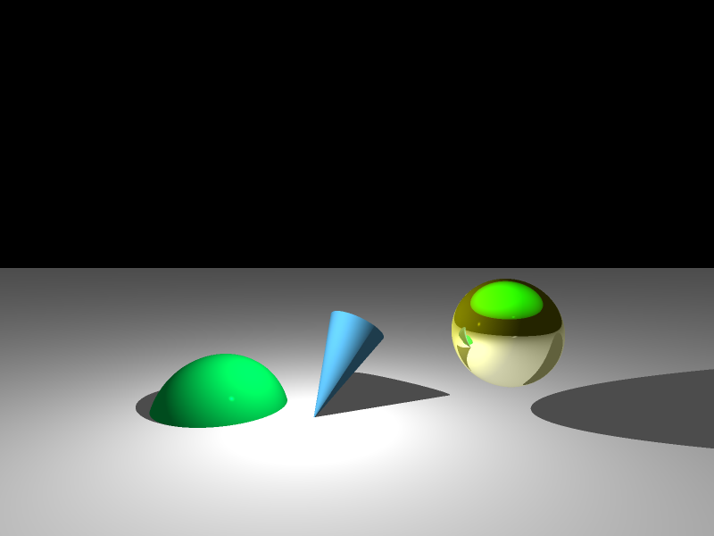
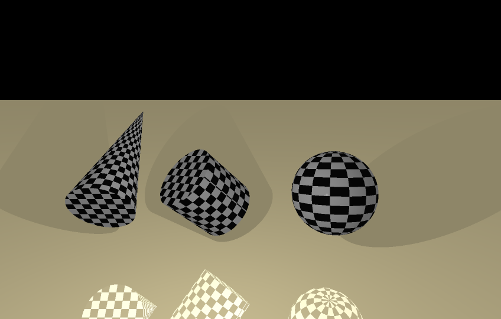
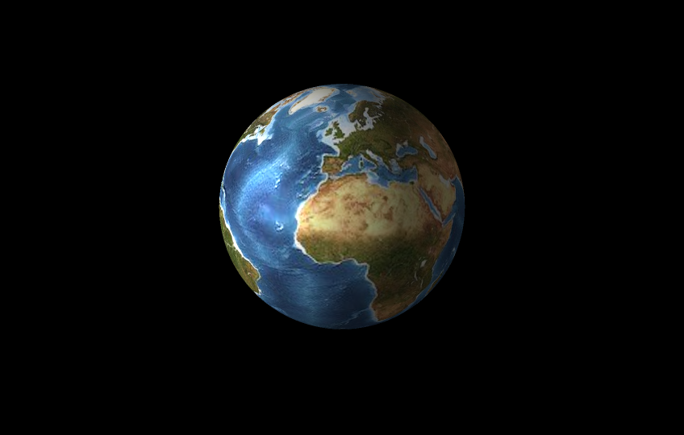
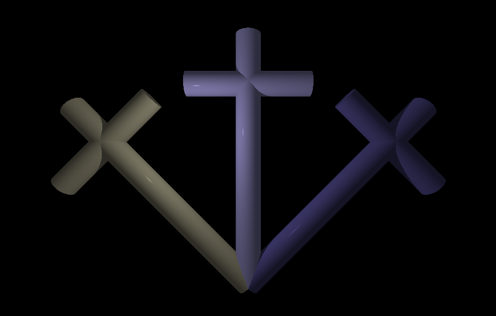

# RT - Ray Tracer

RT is a project that implements a **Ray Tracer** in C. Its goal is to generate 3D images by applying ray tracing techniques, simulating realistic lighting and shadows with multiple optical effects.

In the reference system, +X points to the right, +Y points downward, and +Z points out of the screen (toward the viewer).

## Main Features

- **Ray Tracing implementation** from scratch.
- **Basic geometric objects**: plane, sphere, cylinder, cone.
- **Transformations**: translations and rotations.
- **Light management**: different brightness, shadows, multi-spot and shine effect.
- **Optimized redrawing**: updates the image without recalculating the entire scene.
- **Features:**

	**Parallel light**
	
	1. A parallel light illuminates the scene in a given direction.

	**Ambiance light**
	
	2. No object is ever completely in the dark.
	3. The ambiance light can be managed from a configuration file.

	**File**
	
	4. Scene files follow a proper hierarchical structure. You can load existing files, and also create and save new scenes directly within the program.

	**Visual effects**
	
	5. You can apply Sepia, Grayscale, Inverted, and Posterized filters to the scene.
	6. Antialiasing using supersampling 2x2.

	**Technical effects**

	7. Multi-thread computing.

	**More simple objects**
	
	8. Paraboloid.

	**Reflection**
	
	9. There is a mirror effect.
	10. It’s possible to change the % of reflection.

	**Transparency**

	11. We can see through.
	12. It's possible to change the % of transparency.
	13. The shadow is more or less darken if the object is transparent.
	14. It can be defined a `refraction index` that is used in the Descartes formula.

	**Interface**

	15. The rendered image can be saved as a png file.
	16. There is a status bar and a progress bar.
	17. It's possible to select a camera, and move it along the three directions.
	18. You can design the scene directly in the program by simply clicking and filling in the details.

	**Exotic objects**

	19. Torus.
	20. 3-twisted Möbius strip.

	**Composite objects**
	
	21. It's possible to define composite elements, put them several times, and apply translations, rotations, color, brightness, transparency and reflectivity.
	22. Composite objects can be stored in libraries as files, and later instantiated.

	**Limited objects**

	23. It is possible to choose the slice position and direction.
	24. The slice effect is unique to every object and not applied on all of them.
	25. Rotations and translations still work after the slice.

	**Textures**:

	26. A texture can be applied on the four basic objects.
    27. It is possible to stretch a texture on an object.
   	28. This project uses the STB libraries by Sean Barrett (`stb_image.h` and `stb_image_write.h`) for image loading and saving.

	**Color Disruptions**

	29. Checkerboard.


## Compilation and Installation

Compile the project with **make**, then run the **rt** executable. The main window will appear with the following options:

- **Load** : Select a pre-configured `.rt` file.
- **Capture** : Save the current rendered image as a PNG file.
- **Scene** : Start a new scene from scratch. A separate window will open, allowing you to add objects, lights, and cameras as desired.
- **Composite** : Lets you create a composite object and save it as a library for later use.
- **Filters** : Apply a visual filter to the rendered scene. Available options are: `Sepia`, `Grayscale`, `Invert`, and `Posterize`. Select `None` to display the original colors.  
- **Camera** : Switch to a different camera if multiple cameras are available.
- **Exit** : Close the program.


## Keyboard Shortcuts

You can also access most menu options via the following keys:

| Key         | Action                                       |
|-------------|----------------------------------------------|
| **L**       | Load a file                                  |
| **C**       | Capture the image                            |
| **S**       | Create a scene                		         |
| **M**       | Create a composite object                    |
| **Esc**     | Exit the program                             |
| **N**       | Apply no filter (original colors)            |
| **G**       | Apply Grayscale filter                       |
| **E**       | Apply Sepia filter                           |
| **P**       | Apply Posterize filter                       |
| **I**       | Apply Invert filter                          |
| **1**–**9** | Select a camera by its number (if available) |


## Camera Movement

You can move the camera using the keyboard. The available controls are:

| Key / Action       | Description                |
|--------------------|----------------------------|
| **Arrow Up**       | Move the camera up         |
| **Arrow Down**     | Move the camera down       |
| **Arrow Left**     | Move the camera left       |
| **Arrow Right**    | Move the camera right      |
| **Page Up**        | Move the camera forward    |
| **Page Down**      | Move the camera backward   |


## File Syntax

Files define the scene using a list of objects, lights, and global settings. Use JSON format, and give them the `.rt`  extension.


### Global Configuration

- **Cameras** :  At least one must be defined, and multiple cameras can be included. FOV must be in the range [10, 180]
```json
	"cameras":
	[
		# Camera 1
		{
		"position": "0,3,25",
		"direction": "0,0,-1",
		"fov": 80
		},
		# Camera 2
		{
		"position": "0,3,35",
		"direction": "0,0,-1",
		"fov": 90
		},
		# Camera 3
		{
		"position": "0,3,20",
		"direction": "0,0,-1",
		"fov": 80
		}
	]
```
- **Lights** : Here, it is possible to define three types:
	- `ambient`: Defines a single ambient light in the scene. If **not defined**, the default values are 0.25 (minimum allowed) and white (255,255,255). Objects are never completely dark.
	- `spots`: Defines multiple spot lights. Bright must be a number in the range [0,1]
	- `directional`: Defines only one parallel light. It is optional.
```json
 
	"ambient":
	{
		"bright": 0.3,
		"color": "255,255,255"
	},
	"directional":
	{
		"direction": "0,-1,0",
		"bright": 0.8,
		"color": "255,255,255"
	},
	"spots":
	[
		# Spotlight 1
		{
		"position": "-2,3,1",
		"bright": 0.8,
		"color": "255,255,255"
		},
		# Spotlight 2
		{
		"position": "2,-3,1",
		"bright": 0.8,
		"color": "255,0,0"
		}
	]
	
```

### Geometric Objects

Multiple objects can be included. They are defined by their own parameters. Furthermore, you can add instances from an existing library.

**Important**: The direction vector must be normalized, meaning each component is in the range [0,1].
- **Sphere**:
```json
	"spheres":
	[
		{
		"center": "7,0,0",
		"radius": 2.5
		}
	]
```
- **Plane**:
```json
	"planes":
	[
		{
		"position":"0,-4,0",
		"normal":"0,1,0"
		}
	]
``` 
- **Cylinder**: 
```json
	"cylinders":
	[
		{
		"position": "0,10,-2",
		"radius": 1.5,
		"direction": "0.4,-0.4,-0.4",
		"height": 5.0,
		}
	]
``` 
- **Cone** 
```json
	"cones":
	[
		{
		"position": "0,10,-2",
		"radius": 1.5,
		"direction": "0.4,-0.4,-0.4",
		"height": 5.0,
		}
	]
``` 

- **Paraboloid**
```json
	"paraboloids":
	[
		{
		"center": "-5,12,-20",
		"direction": "-0.6,-0.4,0.5",
		"height": 13.0,
		"k"	: 2,
    	}
	]
``` 

- **Torus**
```json
	"tori":
	[
		{
		"center": "0,0,0",
		"direction": "0,1,0",
		"minor": 3,
		"major"	: 8,
    	}
	]
``` 

- **Möbius strip**
```json
	"moebius":
	[
		{
		"center": "0,0,0",
		"direction": "0,0,1",
		"width": 0.1, #This value must be in the range [0,1]
		"radius":2
    	}
	]
``` 



## Optional properties
- `translate` : Defined by translation vector:  "t<sub>x</sub>, t<sub>y</sub>, t<sub>z</sub>".
- `rotate` : Defined by the rotation angles (in degrees), one per axis (x, y, z).
- `color`: "R,G,B". If omitted, it defaults to white: "255,255,255".
- `shine`: A number in the range [10,1000]. If omitted, it defaults to 10.
- `reflectivity`: A number in the range [0,1]. If omitted, it defaults to 0.
- `transparency`: A number in the range [0,1]. If omitted, it defaults to 0.
- `refraction`: A number in the range [1,5]. If omitted, it defaults to 1.
- `slice`: You can define multiple planes to slice any object. The slicing operation will be determined solely by the properties of the planes.
- `texture`: This property applies a texture to the basic objects (sphere, plane, cylinder and cone), making the <i>color</i> property deprecated.  You can choose between two types: <i>Checkerboard</i> and <i>image</i>. For the <i>image</i> type, you must provide the name of an image file.

Objects may include any of these parameters or omit them.




```json
 "(object)":
	[
    	{
		(fixed parameters)
			...

        "color": "120,180,240",
        "shine": 64,
        "reflectivity": 0.5,
		"transparency": 0.84,
		"refraction": 1.04,
		"translate": "0,0,-3",
       	"rotate": "30,0,0",
		"slice":[
			{
				"position":"0,-4,0",
				"normal":"0,1,0"
			},
			{
				"position":"3,-4,0",
				"normal":"1,0,0"
			}
		],
		"texture":"Checkerboard"  # Or a file name
		}
	]
```


```json
 {
	"cameras":
	[
		{
		"position": "0,8,13",
		"direction": "0,-0.5,-1",
		"fov": 80			
		}
	],
	
	"spots":
	[
		{
		"position": "-12,8,8",
		"bright": 0.8,
		"color": "255,255,255"
		}
	],
	
	"spheres":
	[
		{
		"center": "0,3,0",
		"radius": 4,
		"color": "200,200,200",
		
		"reflectivity": 0.7,
		"texture": "textures/earth.jpg"
		}
	]
 }
 ```


## Composite elements and instances
### Option 1: Internal Library

A composite element must first be defined with a **name** and the **objects it contains**, inside the `"library"` array:

```json
"library":[
	{
	"cruz":[
		{
		"type": "cylinder",
		"position": "0,-50,0",
		"direction": "0,1,0",
		"radius": 5,
		"height": 100
		},
		{
		"type": "cylinder",
		"position": "-25,30,0",
		"direction": "1,0,0",
		"radius": 5,
		"height": 50
		}]
	}]
```
After that, you can create instances of this element, with optional properties such as scale, color, rotate, translation, etc. The "use" field is mandatory:
```json
	"instances":
	[
		{
		"use": "cruz",
		"scale": 1,
		"color": "186,180,251",
		"shine": 800
		},
		{
		"use": "cruz",
		"scale": 1,
		"color": "186,180,151",
		"shine": 800,
		"rotate": "0,0,45"
		},
		{
		"use": "cruz",
		"scale": 1,
		"color": "86,80,151",
		"shine": 800,
		"rotate": "0,0,-45"
		}
	]
```
### Option 2: External Library
You can also define a composite element in a separate JSON file, without the "library" wrapper. **Each external file must contain only one composite element.** For example, `cruz.lib` could contain:
```json
{
"cruz":[
	{
	"type": "cylinder",
	"position": "0,-50,0",
	"direction": "0,1,0",
	"radius": 5,
	"height": 100
	},
	{
	"type": "cylinder",
	"position": "-25,30,0",
	"direction": "1,0,0",
	"radius": 5,
	"height": 50
	}]
}
```
To use it in your scene, just point the "use" field to the file path. If the `.lib` file should be placed in the `libraries` folder:
```json
"instances": [
  {
    "use": "./libraries/cruz.lib",
    "scale": 1,
    "color": "186,180,251",
    "shine": 800
  },
  {
    "use": "./libraries/cruz.lib",
    "scale": 1,
    "color": "186,180,151",
    "shine": 800,
    "rotate": "0,0,45"
  },
  {
    "use": "../libraries/cruz.lib",
    "scale": 1,
    "color": "86,80,151",
    "shine": 800,
    "rotate": "0,0,-45"
  }
]
```
And here is the result:
